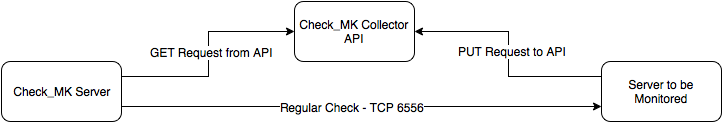

# Check\_MK Collector API
A proof of concept API for Check_MK, that adds support for push-method monitoring.

## Intro
By default, the official version of the Check_MK Monitoring system requires us to connect to a host over TCP 6556 or SNMP to retrieve status data. Outbound connections like this is not suited for monitoring host which exist within seperate private networks (such as IaaS platforms like AWS) where you may not be able to route to the machines.

This project works around that issue by providing API endpoints which an agent running on the host can deliver status updates to. Using the Datasource monitoring method, the Check\_MK server can then request the status data from the API instead of directly from host. The API is intended to be run in a location where both the Check\_MK server and the hosts can access it. In the simplest set up, this could run on a Check\_MK master, or it could run on a separate server entirely.

The below diagram below gives an overview of how data flows between hosts being monitored using either the standard check or the checks using the API.




## Check_MK API (api.py)
This file provides the API itself. Dependencies are provided by the accompanying Python virtual environment. The API listens on TCP Port 8080.

Monitoring data sent to one of the "\<hostname\>" endpoints is timestamped in order to prevent aged data being mistakenly used, in the event that a host goes down or such. 

**Available Endpoints:**

|Endpoint|Method|Desc.|
|---|---|---|
|/collector/api/v0.1/hosts|GET|Outputs a listing of all hosts currently stored in the API|
|/collector/api/v0.1/hosts|POST|Used by the Datasource script to add entries for hosts to be monitored|
|/collector/api/v0.1/hosts/\<hostname\>|GET|Retrieve information for a specific host|
|/collector/api/v0.1/hosts/\<hostname\>|DELETE|Remove a host entry from the API|
|/collector/api/v0.1/hosts/\<hostname\>|PUT|Used by the Push Agent to update status data in the API|


**Example Output:**

```
$ curl http://localhost:8080/collector/api/v0.1/hosts/example.host
{
  "host": {
    "hostname": "example.host", 
    "status_age": null, 
    "status_data": null, 
    "uri": "http://localhost:8080/collector/api/v0.1/hosts/example.host"
  }
}
```

**Output Definitions:**

|Key|Desc.|
|---|---|
|hostname|The name of the host which the status data belongs to|
|status_age|The age in seconds since the status data was last updated on the API|
|status_data|Base64 encoded output from check\_mk\_agent|
|uri|The location the retrieved data came from|

## Check_MK Push Agent (agent.py)
This file is a wrapper for the existing check\_mk\_agent script used to generate status data from a host. The check\_mk\_agent is called and it's output is base64 encoded to make it easier to transport via JSON. Then the data is PUT on to the API. 

The agent is only able to PUT status data in to the API and depends on the datasource script to create an entry in the API for it to push to. This is by design to help prevent data being sent when it's not wanted.


**Example PUT**
```
$ curl -H "Content-Type: application/json" -X PUT -d '{"hostname":"example.host"}' http://localhost:8080/collector/api/v0.1/hosts/example.host
{
  "host": {
    "hostname": "example.host", 
    "status_age": null, 
    "status_data": null, 
    "uri": "http://localhost:8080/collector/api/v0.1/hosts/example.host"
  }
}
```

_Note that it is not actually possible to update a hostname. A new hostname would need to be added by the Datasource script._

## Check_MK Datasource Script (datasource.py)
Used by the Check\_MK server, this file is responsible for pulling the data from the API and presenting it to in the same way it would have been had a regular TCP 6556 check had been performed. The script checks the status\_age value to ensure that the data is still relevant before printing it out.

When this script connects to the API for the first time for a new hostname, it will POST a new entry to allow the host to update it's status data in to.

If we try to request data for a host that doesn't exist in the API, we get this:
```
$ curl -i http://localhost:8080/collector/api/v0.1/hosts/new.host
{
  "error": "Not Found"
}
```

When the datasource program detects that it's trying to check for a missing host, it goes ahead and creates the host:
```
$ ./datasource.py --hostname new.host
{u'host': {u'status_age': None, u'hostname': u'new.host', u'uri': u'http://127.0.0.1:8080/collector/api/v0.1/hosts/new.host', u'status_data': None}}
```

Once the agent has had the chance to update the API with it's current status data we see the following:  
_NB: I trimmed the length of the lines as it's rather long otherwise ;)_
```
$ curl localhost:8080/collector/api/v0.1/hosts/new.host 2>/dev/null | sed 's/\(.\{,80\}\).*/\1/'
{
  "host": {
    "hostname": "nuc.finalduty.me", 
    "status_age": 29.420053958892822, 
    "status_data": "PDw8Y2hlY2tfbWs+Pj4KVmVyc2lvbjogMS4yLjZwMTIKQWdlbnRPUzogbGlu
    "uri": "http://localhost:8080/collector/api/v0.1/hosts/new.host"
  }
}
```

Now when the datasource script rechecks it next time, we get the output from the script we would expect if we had been able to connect over TCP 6556:  
_NB: Output is trimmed to just the beginning as again, it's rather long otherwise \^\_\^_
```
$ ./datasource.py --hostname new.host | head -8
<<<check_mk>>>
Version: 1.2.6p12
AgentOS: linux
AgentDirectory: /etc/check_mk
DataDirectory: /var/lib/check_mk_agent
SpoolDirectory: /var/lib/check_mk_agent/spool
PluginsDirectory: /usr/lib/check_mk_agent/plugins
LocalDirectory: /usr/lib/check_mk_agent/local
```

If we leave the data too long, the datasource script picks up on that for us:
```
$ curl localhost:8080/collector/api/v0.1/hosts/new.host 2>/dev/null | grep status_age 
    "status_age": 527.2062299251556,
	
$ ./datasource.py --hostname new.host
status_data is out of date :(
```

## Docker Container (Dockerfile)
The API is also available as a Docker container for easy testing or deployment.

To build:  
`docker build -t local/checkmk-collector -f Dockerfile .`

To run:  
`docker run -it --rm -p 8080:8080 local/checkmk-collector`
